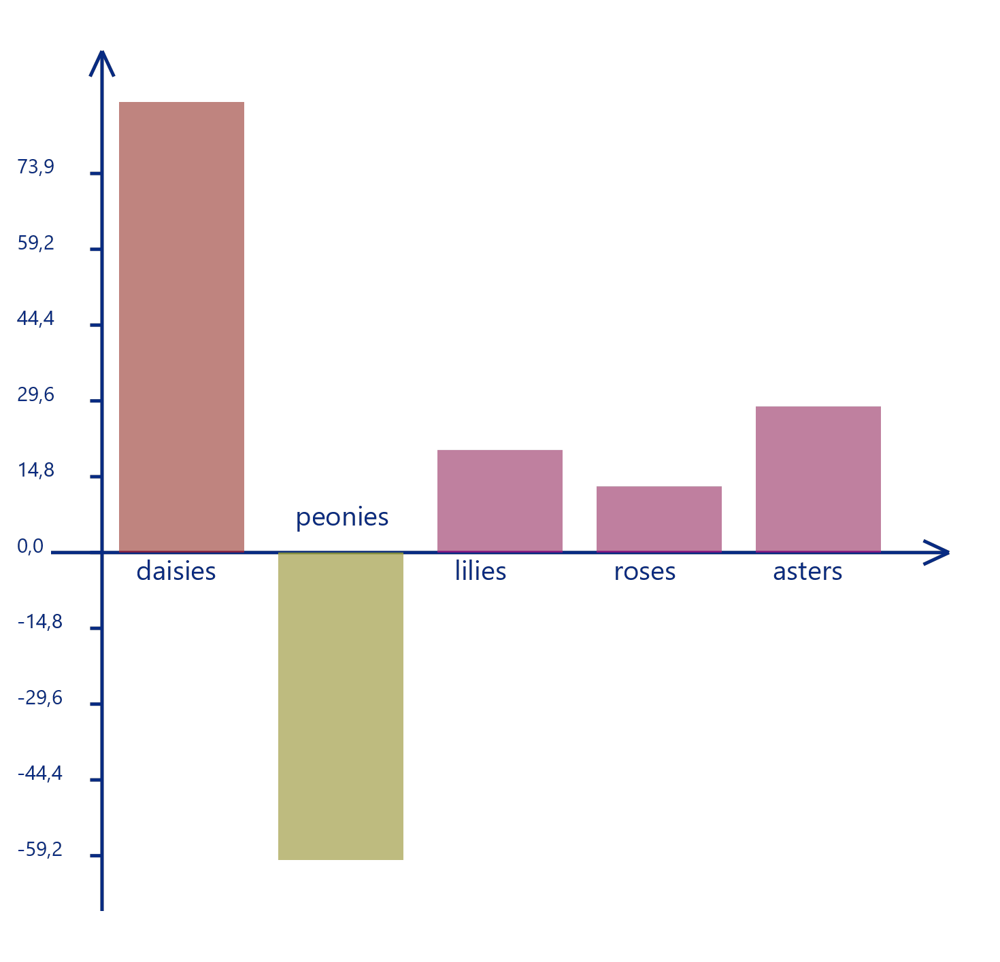
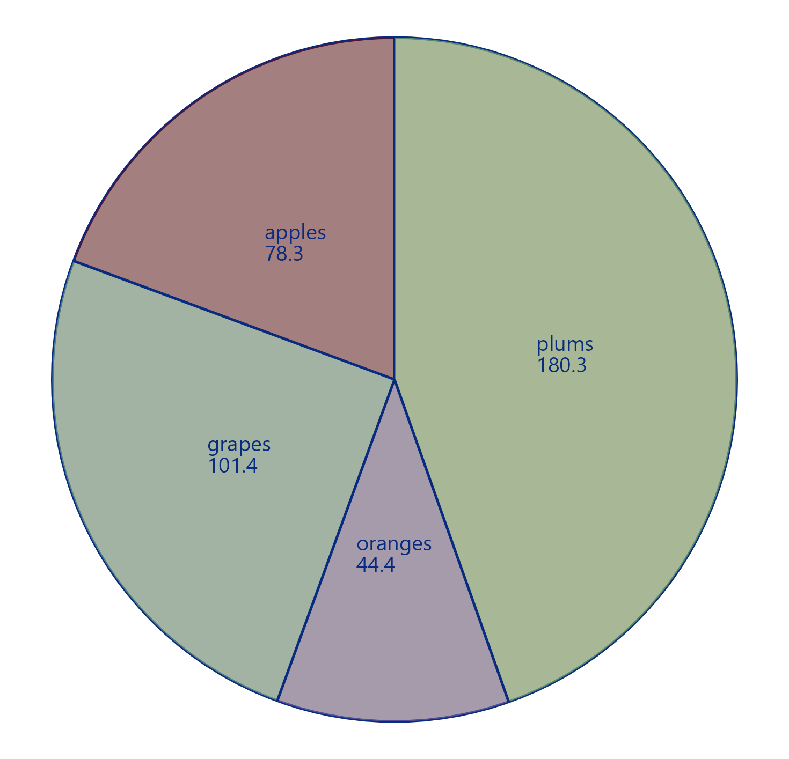

## Использование программы

В данном проекте реализуется представление информации в виде
графического изображения. Программа поддерживает три типа диаграмм: 
круговую, гистограмму и диаграмму рассеивания.

### Входные данные
На вход программе подается требуемый тип диаграммы -
`round` для круговой, `histogram` для гистограммы или
`scatterplot` для диаграммы рассеивания. Далее через пробел 
перечисляются аргументы: типы элементов и их значение. 

Тип элемента (его название) - строка из непробельных символов. Программа
поддерживает произвольные длины строк, но при длинных строках
или маленьком окне возможны наложения. 

Программа поддерживает работу с действительными числовыми 
значениями. Дробная часть должна отделяться точкой.
Последний аргумент должен содержать
имя PNG-файла для сохранения результата.

Программа нарисует диаграмму в графическом окне 
и сохранит результат в указанный файл (если файл не существует,
то создастся новый).

#### Гистограмма
```
$ viz histogram daisies 87.9 peonies -60.0 lilies 20.0 roses 12.9 asters 28.5 src/data/histo1.png
```


#### Круговая диаграмма 
Числовые значения для рисовки круговой диаграммы должны быть
положительные.
```
$ viz round apples 78.3 grapes 101.4 oranges 44.4 plums 180.3 src/data/round1.png
```


При вызове команды `round` с отрицательными значениями программа выбросит соответствующее исключение.
```
$ viz round carrots 10 bananas -10 src/data/round2.png
```

```Exception in thread "main" NegativeArgument: 
value of bananas expected to be a positive number in Round diagram type, but was -10.0
```

#### Диаграмма рассеивания

### Обработка ошибок
При каких-либо ошибках (нехватке аргументов, несоответствии типов аргументов)
программа выбросит соответствующие исключения.

```
$ viz
$ viz oval
$ viz oval cookies 78 src/tmp/path1.jpg
$ viz scatterplot 75.5 13 
$ viz round banana eggs src/tmp/path1.jpg
```

```
Exception in thread "main" EmptyQuery: empty query
Exception in thread "main" NotEnoughArguments: expected diagram type, parameters and file name
Exception in thread "main" UnsupportedDiagram: diagram type "oval" is not supported
Exception in thread "main" InvalidArgumentsNumber: expected diagram type, parameters and file name
Exception in thread "main" InvalidArgument: value of banana expected to be a number, but was eggs
```