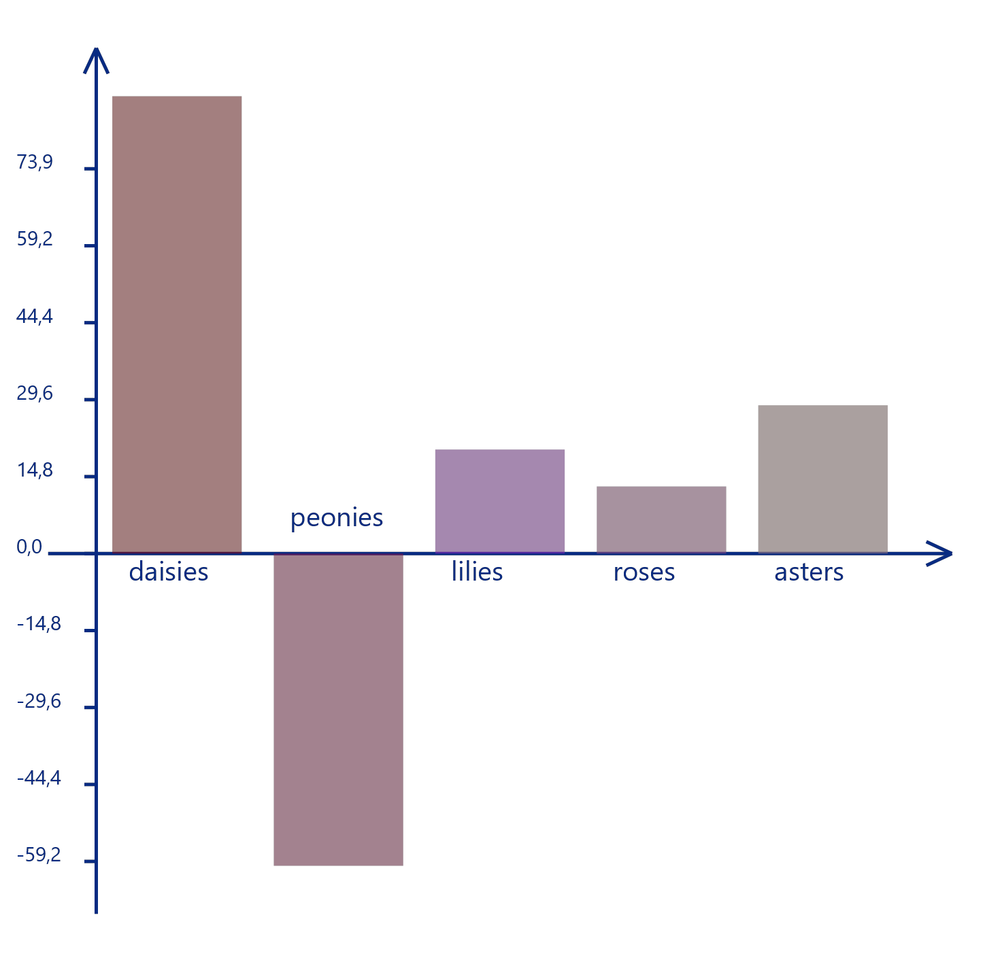

## Использование программы

В данном проекте реализуется представление информации в виде
графического изображения. Программа поддерживает три типа диаграмм: 
круговую, гистограмму и диаграмму рассеивания.

### Входные данные
На вход программе подается требуемый тип диаграммы -
`round` для круговой, `histogram` для гистограммы или
`scatterplot` для диаграммы рассеивания. Далее через пробел 
перечисляются аргументы: типы элементов и их значение. 

Тип элемента (его название) - строка из непробельных символов. Программа
поддерживает произвольные длины строк, но при длинных строках
или маленьком окне возможны наложения. 

Программа поддерживает работу с действительными числовыми 
значениями. Дробная часть должна отделяться запятой.
Последний аргумент должен содержать
имя PNG-файла для сохранения результата.

Программа нарисует диаграмму в графическом окне 
и сохранит результат в указанный файл (если файл не существует,
то создастся новый).

При каких-либо ошибках программа выбросит соответствующие исключения.

#### Гистограмма
```
$ viz histogram daisies 87.9 peonies -60.0 lilies 20.0 roses 12.9 asters 28.5 src/data/histo1.png
```


#### Круговая диаграмма 
Числовые значения для рисовки круговой диаграммы должны быть
положительные.
```
$ viz round apples 78.3 grapes 101.4 oranges 24.4 plums 180.3 src/data/round1.png
```


#### Диаграмма рассеивания
В диаграмме рассеивания 